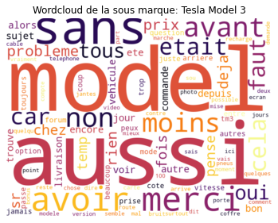
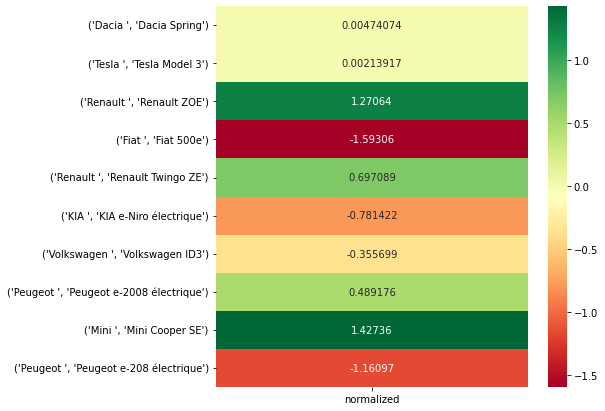

### Date : 02/2022
### Polytechnique-HEC Master in Data Science
# Objectives
This NLP project proposed by Capgemini Invent consisted in conducting a complete analysis on the electrical car leasing market and proposing a strategy for the launch of a bank's new offer.  
  
The analysis was composed of three steps :  
- web scrapping of users comments from a car forum  
- preprocessing and wordclouds generations (notebook 1)  
- sentiment analysis (notebook 2)  
  
You will also find the final presentation retracing the whole study and final strategy proposed to the bank.   
  
Here is the wordcloud obtained with the Tesla Model 3 :  
   
  
Here is the comparison of the sentiment analysis applied on the comments of the forum :  
  