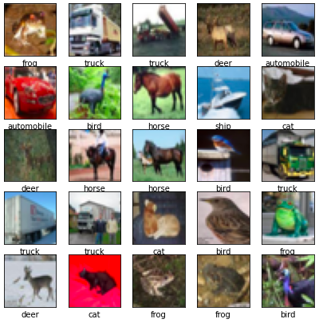

### Date : 12/2020
### University Carlos III of Madrid
# Description of the project  
This is a computer vision project using deep learning.  
The objective is to develop and optimize a neural network capable of recognizing the objet on a picture, among those of our dataset.  
  
The data used to conduct this project is the Cifar10 database, a set of 60000 32x32 color images of 10 objects :   
  
  
We optimized both a multi-perceptron and a convolucional neural network and compared the performances reached.  
  
# Results  
We obtained an accuracy score of 0,82.